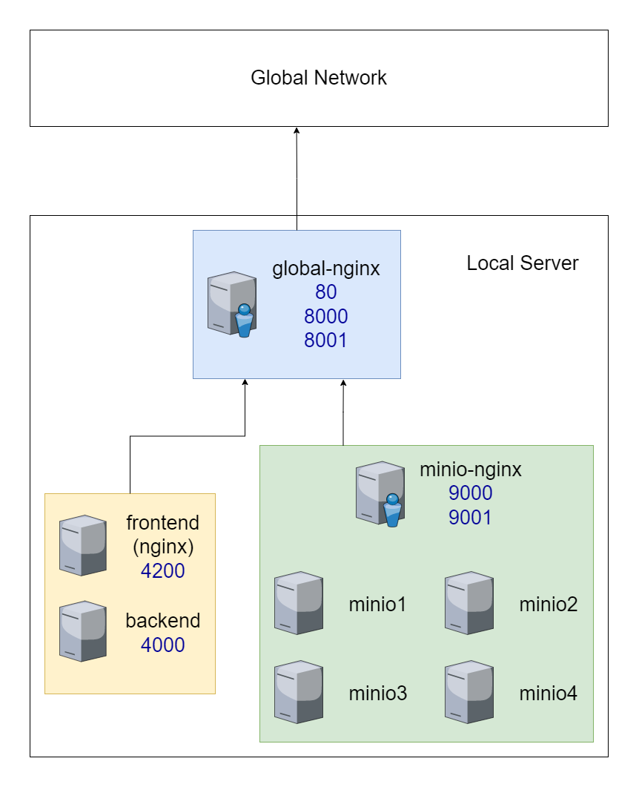

In this repo, when "docker-compose up" is done under the nginx folder, the application broadcasts minio over localhost:8000 and broadcasts frontend over localhost:80.

Once the docker-compose up command is executed, when BUCKET, ACCESS_KEY_ID, SECRET_ACCESS_KEY are obtained by connecting to the minio application from localhost:8000 and data entry is made in the .env file in the backend folder and when http://public-ip:9000 is entered instead of localhost in ***ENDPOINT***, the upload feature works from localhost:80 via frontend. 

- Expose the ports of frontend, backend and minio services in the global nginx service (frontend and backend on port 80, minio services on ports 8000 and 8001),
- The global nginx service is made live by proxying the 9000 and 9001 ports of the nginx service in the minion to ports 8000 and 8001.

*** In the docker-compose.yaml file, the services are run with images, and if the images are removed, the docker-compose file can be rebuilt by updating the 
IP addresses in the env files.

The diagram below describes the architecture of the system. The colored boxes represent the different docker compose groups.

  

  <h3>Architecture of the System</h3>
  

